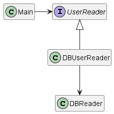

# The Adapter Pattern

The goal of the adapter pattern is to provide a way for one class to use another even in the case they work with different interfaces.

The adapter, which is also called a wrapper, sits in the middle of the two classes, allowing the "client" class to access the "provider" class functions without having the need to change the client interface.

In the example code, the Main class is the **_client_**.
It uses the UserReader interface to get a list of users.

In order to prevent Main from having to change its implementation to adapt to the DBReader class, the **_adaptee_**, we have introduced an **_adapter_**, the DBUserReader class.

It is the DBReader class makes the necessary operations to adapt the client call to the supported call in the DBUserReader class.

Note: **The adapter pattern does not add any behaviour to the behaviour already provided by the adaptee**, it only makes the appropriate signature translation!