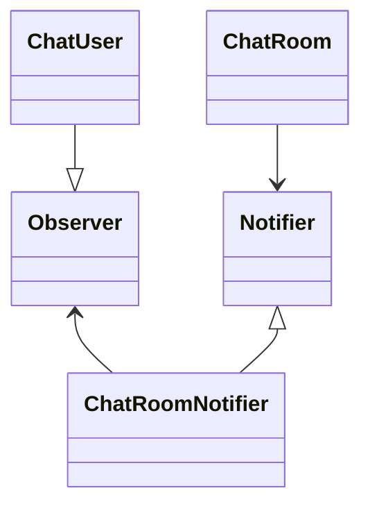

# Observer Pattern 2

This is just me trying to overcome the Single Responsibility Principle violation of the Observer Pattern with delegation.

```mermaid

classDiagram
  class ChatRoom
  class ChatUser
  class ChatRoomNotifier
  interface Notifier
  interface Observer

  ChatUser --|> Observer
  Observer <-- ChatRoomNotifier

  ChatRoom --> Notifier
  Notifier <|-- ChatRoomNotifier

```
