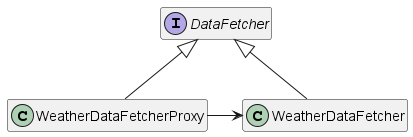
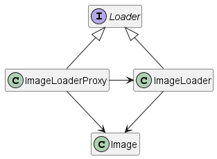
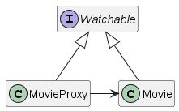

# Proxy Pattern (also known as surrogate design pattern)

A proxy is a class that is put in front of another class that we want to control access to.
It is important to note that **a proxy implements the same interface as the class it proxies to**.
Therefore, the client does not know if it is using the own class or a proxy to it.

We can have a proxy to control access to a resource:
* that is remote: a **remote proxy**
* that is expensive to create: a **virtual proxy** (so that we can try to minimize the performance impacts of accessing it)
* based on access rights: a **protection proxy** (so that we can filter requests that should not be allowed)

A proxy may also do additional house-keeping job like audit tasks.

In the remote example, we have a WeatherDataFetcher class in front of a WeatherData class that would access a REST endpoint somewhere.

In the virtual proxy example, we have an ImageLoaderProxy in front of a class which has an expensive function (but we could also be talking about an expensive constructor).
The ImageLoaderProxy uses a cache to reduce the overhead of calling the expensive class function.

In the protection example, only old-enough users are allowed to watch certain movies. This functionality was added by the MovieProxy class.

### References

* https://www.youtube.com/playlist?list=PLrhzvIcii6GNjpARdnO4ueTUAVR9eMBpc
* https://en.wikipedia.org/wiki/Proxy_pattern